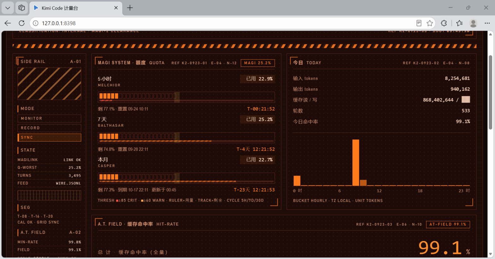

# Kimi Code 计量台 · NERV Usage Board

一个零依赖、单文件的 **Kimi Code 本地用量仪表盘**——扫描本机 `wire.jsonl` 会话日志，在浏览器里打开一个 EVA/NERV 风格的实时监控台。数据不出本机，服务只监听 `127.0.0.1`。



## 快速开始

需要 Python 3.8+（仅用标准库）：

```bash
python dashboard.py        # 起服务并自动打开 http://127.0.0.1:8398
python dashboard.py --no-open   # 只起服务，不开浏览器
```

页面每 60 秒自动轮询一次数据。

## 界面

- **顶部指挥横幅**：系统标题、实时时钟、运行时长、密级条
- **SIDE RAIL**：模式扫描器、链路状态、A.T. FIELD 迷你状态、竖向液位计（最紧张额度）、24h 活动刻度、EVA-01 机体剪影（能量扫描动效）
- **MAGI SYSTEM**：5 小时 / 7 天 / 本月三条额度（MELCHIOR / BALTHASAR / CASPER），用量刻度尺 + 秒级重置倒计时 + 剩余时间细线
- **A.T. FIELD**：全量缓存命中率大数字 + 近 60 分钟极坐标圆盘（圆周=60 分钟，半径=命中率，虚线环=95% 基线，悬停逐分钟读数，直径标尺）
- **今日**：输入/输出/缓存 tokens、轮数、按小时柱状图（机场翻牌动效）
- **近 30 天**柱状图、**工作区排行**

## 数据源

| 数据 | 来源 |
|---|---|
| token 用量 / 缓存命中率 | `~/.kimi-code/sessions/**/wire.jsonl` 里的 usage 记录（增量偏移缓存，只解析新增字节） |
| 5 小时 / 7 天额度 | Kimi Code CLI 本地服务 `GET /api/v1/oauth/usage`（Bearer `~/.kimi-code/server.token`，自动发现最新实例） |
| 会员级别 / 昵称 | 同上 `GET /api/v1/oauth/userinfo` |
| 月度额度 | Kimi 官网云端接口，令牌来自本机 Kimi 桌面端存储；桌面端离线时回落到本地缓存值或显示 `--` |

说明：

- **缓存写恒为 0 属正常**：Kimi 只上报缓存命中读取量（`inputCacheRead`），不上报创建量，界面以马赛克块占位。
- 本地 CLI 服务未运行时，5h/7d 显示「不可用」，其余板块不受影响。
- 聚合缓存 `usage_cache.json` 按显示窗口裁剪（天级 35 天、分钟级 2 小时），体积 bounded，损坏自动重建。

## 桌面组件

`kimi_widget.py` 是同数据源的 Windows 桌面悬浮卡片（tkinter，无边框置顶，拖拽/右键菜单/30 分钟刷新）。直接 `pythonw kimi_widget.py` 运行；需要开机自启可自行创建一个调用它的 `.vbs` 放入启动文件夹。

## 隐私

所有解析、聚合、渲染都在本机完成；除向 Kimi 官方接口拉取本人额度外，无任何外发数据。仓库中的截图已脱敏。

## 设计

视觉系统来自 [eva-ui-skill](https://clawhub.ai/sullivangu/skills/eva-ui-skill)（EVA 风格 UI 设计规范），标题字体为 EVA 明朝风格复刻。本项目为非官方个人作品，与 Moonshot AI / 月之暗面无关，Kimi 机器人形象仅作个人学习用途。

## License

MIT
